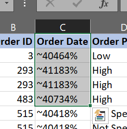
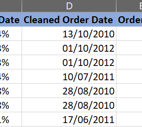
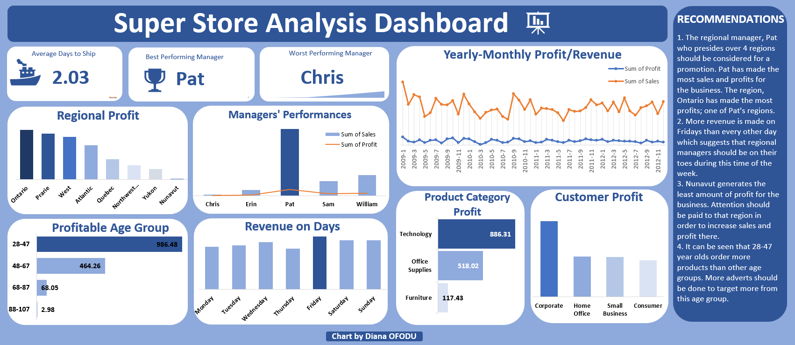
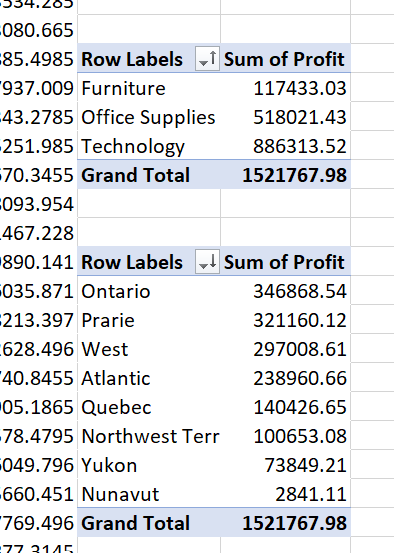

# Excel Super Store Analysis

## INTRODUCTION
This was my second Excel data analysis project and the first one I was actually proud of. I was given this dataset by a friend. The dataset comprised 3 different tables. Extraction, data cleaning and visualization were all done in Excel.

## SKILLS/CONCEPTS DEMONSTRATED
**Microsoft Excel Concepts Applied:**
-	Functions
-	Formulas
- Pivot tables

## PROJECT OBJECTIVE
-	Determine how long it takes on average to ship an order
-	Determine the most Profitable Age group
-	Determine what day of the week brings in more sales
-	Determine the performances of the managers and recommend a manager for promotion.

## DATA SOURCING
This data landed in my email minutes after I requested for it from a friend. It comprised of 3 .txt files. I went on to import them into 3 separate worksheets in an Excel workbook. 
**The sheets were renamed accordingly:**
-	SALES TRANSACTION with 8400 and 22 columns
-	REGIONAL MANAGERS with 9 rows and 2 columns
-	RETURNED ITEMS with 573 rows and 2 columns

## DATA CLEANING
The data cleaning process was an interesting one as I had never really experienced data as noisy as what I saw. The order date was not in the right format and was preceded by symbols.
Unclean Order Date          | Cleaned Order Date
:--------------------------:|:---------------------------:
 | 

The following are some steps and functions I used to get the data into a good enough shape for analysis and visualizations:
- To clean the order date column, the `MID()` function was used to extract the middle numbers of the date and the `INT()` function was used to convert the values to numbers before changing the date column to a date format. `INT(MID(C2))`
- Missing values were filled using the average of the values in the column.
-	New columns were created to extract the day, month, year and day of the week from the order date column. The following functions were used:
    
    - `DAY()` – To extract the day from a date
    
    - `MONTH()` – To extract the month from a date
    
    - `YEAR()` – To extract the year from a date
    
    - `TEXT(WEEKDAY(), “dddd”)` – To return the day of the week from a date and converting it to text format.
-	The time it takes for an order to be shipped was gotten by calculating the difference between the order date and the shipped date. This function was used: `DAYS( , )`
-	An age column was derived by taking the difference between the customers’ date of birth and the order date. 
-	A regional manager column and a status of returned items column were added to the sales transaction sheet using the `VLOOKUP()` function.
-	Several other columns were derived using `IF()` statements/functions.

## DATA ANALYSIS AND VISUALIZATION

---
-	Multiple pivot tables where used to summarize the data in preparation for visualization.

-	From the dashboard, it is observed that it takes an average of 2 days for an ordered product to be shipped to the end user.
-	Revenue is gotten the most on Fridays and Ontario recorded the highest amount of profits.
-	Technological goods are sold more with corporate customers buying more goods.
-	Pat has the best performance by the amount of sales and profits made.

## RECOMMENDATION
1.	The regional manager, Pat who presides over 4 regions should be considered for a promotion. Pat has made the most sales and profits for the business. The region, Ontario has made the most profits; one of Pat's regions.
2.	More revenue is made on Fridays than every other day which suggests that regional managers should be on their toes during this time of the week.
3.	Nunavut generates the least amount of profit for the business. Attention should be paid to that region in order to increase sales and profit there.
4.	It can be seen that 28-47 year olds order more products than other age groups. More adverts should be done to target more from this age group.
